# Mechanical-Design-Portfolio | Mechanical Engineering Portfolio

Mechanical Engineering student specializing in Automotive System Design and CAD-based Product Development.

---

## 🔧 Core Specialization
- Manufacturing Drawing
- Automotive Component Design
- Assembly Modeling in CATIA V5
- Solid Modeling and Motion Understanding
- Basic Design Validation Concepts

---

## 🛠 Software Skills
- CATIA V5 (Part Design, Assembly, Drafting)
- SolidWorks (Part & Assembly Modeling)
- Engineering Drawing with GD&T fundamentals
- Basic understanding of Engineering Drawing

---

# 🚗 Projects

---

## 1️⃣ IC Engine Assembly (CATIA V5)

### Full Assembly View
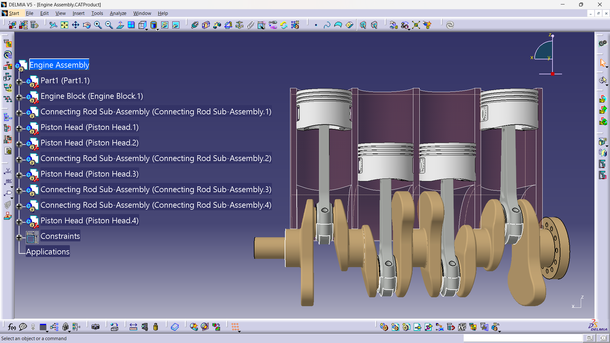

### Multiview Layout
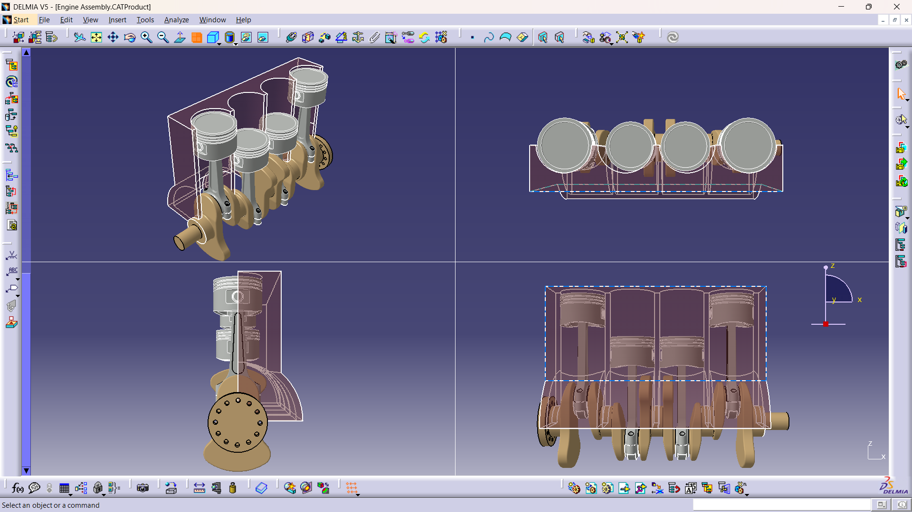

### Engine 2D Draft
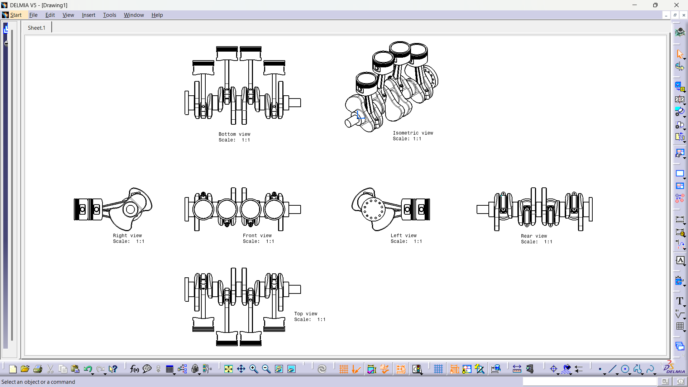

### Objective
To model and assemble a complete internal combustion engine with proper constraints and motion relationships.

### Work Done
- Modeled piston, connecting rod, crankshaft, cylinder block, and valves
- Applied assembly constraints
- Verified motion mechanism of crank-slider system
- Generated 2D drafting views

### Key Learning
- Engine kinematics
- Assembly hierarchy management
- Motion relationship between components
- Mechanical tolerance awareness

---

## 2️⃣ Valve Assembly Design (CATIA V5)

### Full Assembly View
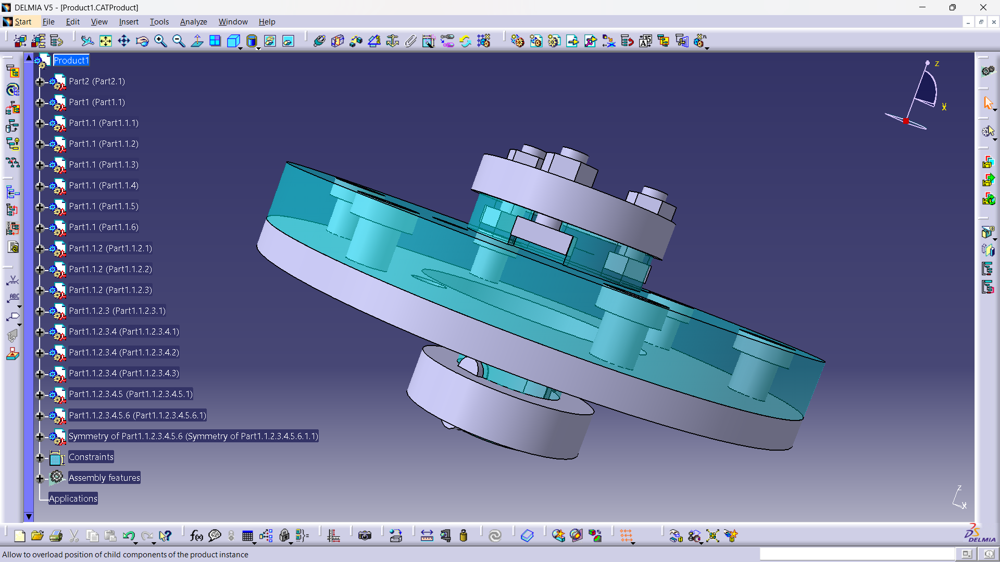

### Multiview Layout
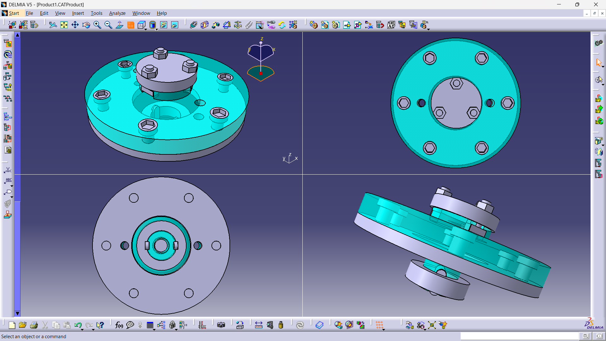

### Valve 2D Draft
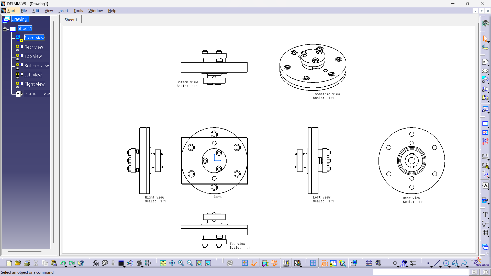

### Objective
To create a detailed valve mechanism assembly and analyze its motion functionality.

### Work Done
- Designed valve body, stem, spring, retainer
- Applied parametric constraints
- Studied valve timing interaction conceptually
- Created detailed engineering drawings

### Key Learning
- Precision component modeling
- Spring-seat interaction
- Manufacturing awareness in small components

---

## 3️⃣ Wheel Suspension System (CATIA V5)

### Full Assembly View
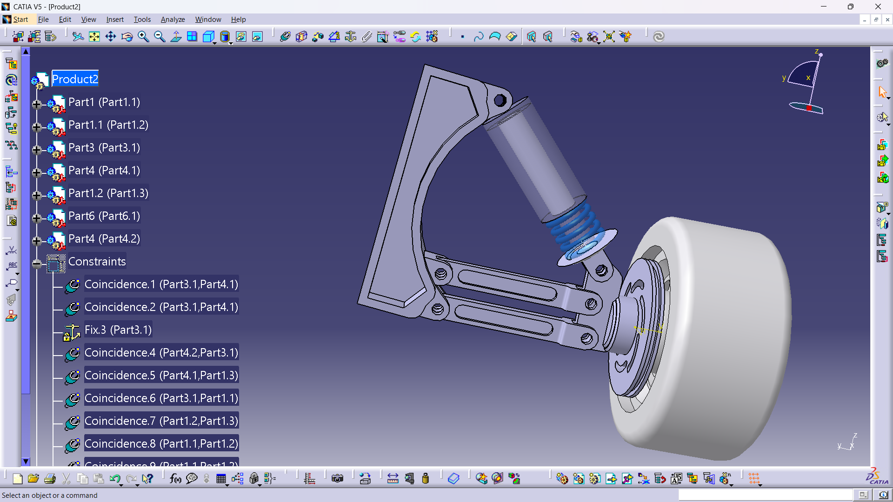

### Multiview Layout
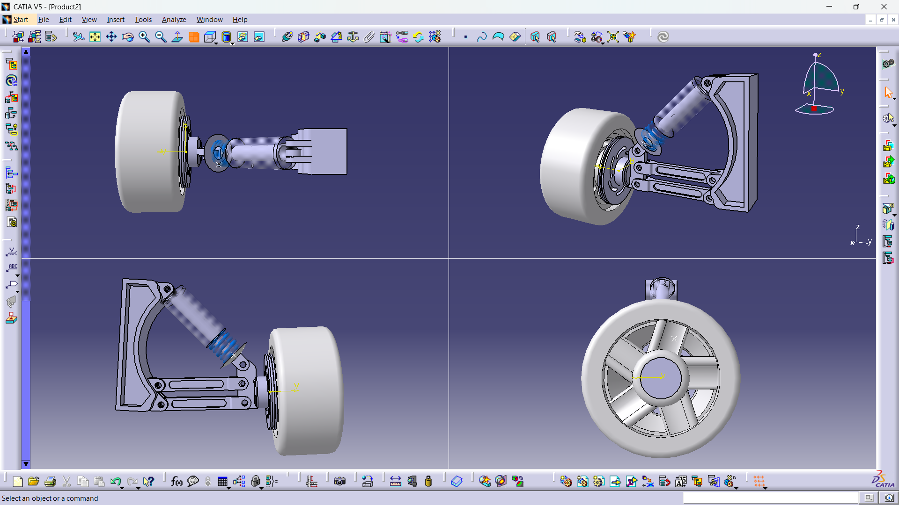

### Suspension 2D Draft
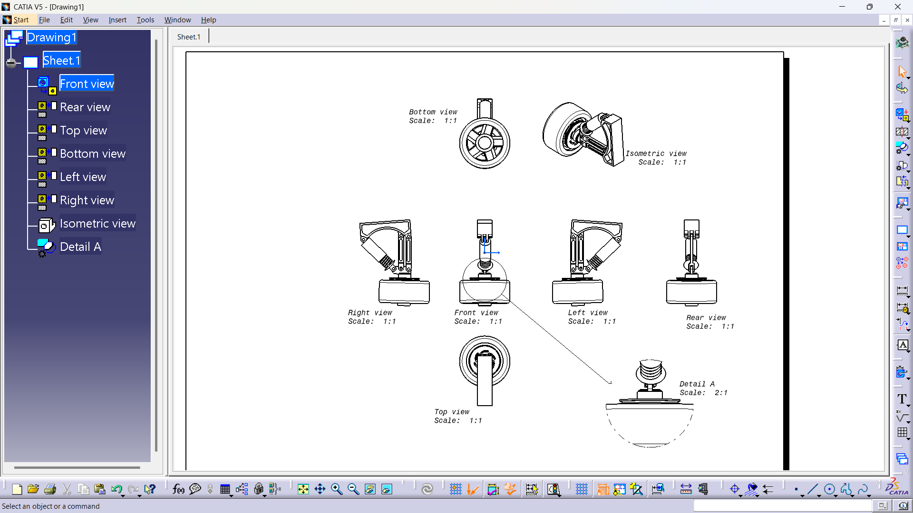

### Objective
To model a basic automotive suspension system and understand load transmission.

### Work Done
- Designed control arm, hub, coil spring setup
- Built complete assembly structure
- Studied suspension geometry
- Explored motion limits conceptually

### Key Learning
- Load path understanding
- Suspension articulation
- Assembly constraint management

---

## 4️⃣ 6-Axis Industrial Robot Arm (CATIA V5)

### Objective
To design and assemble a 6-axis industrial robotic arm using CATIA V5 and understand multi-axis joint motion used in industrial automation.

### Work Done
- Modeled base, shoulder, forearm, wrist joints, and gripper components
- Created complete robotic arm assembly in CATIA V5 Assembly Workbench
- Applied rotational constraints to simulate joint movement
- Structured assembly hierarchy for easier component management
- Designed gripper mechanism for object handling

### Key Learning
- Multi-axis kinematic mechanism understanding
- Assembly constraint control in complex systems
- Robotic arm joint articulation principles
- Mechanical linkage coordination in automation systems

---

## 5️⃣ Coilover Shock Absorber Design (SolidWorks)

### Full Assembly View
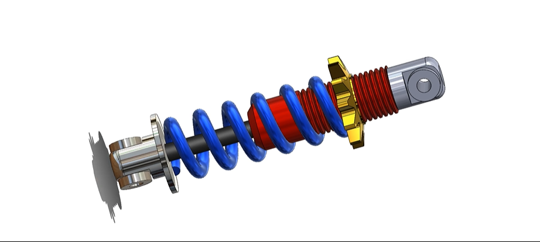

### Multiview Layout
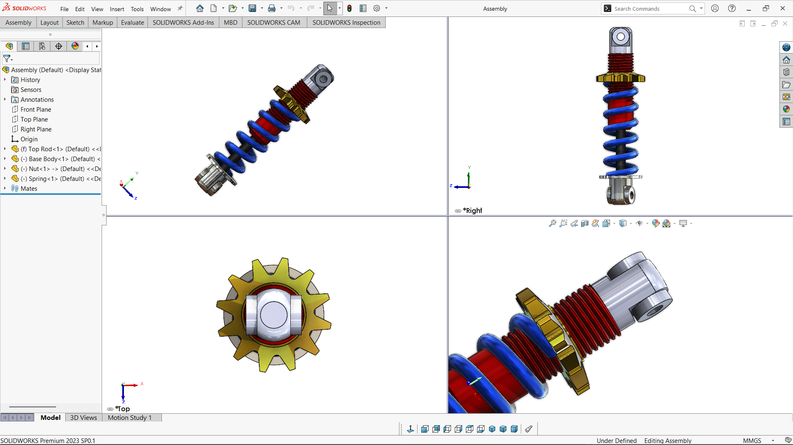

### Exploded View
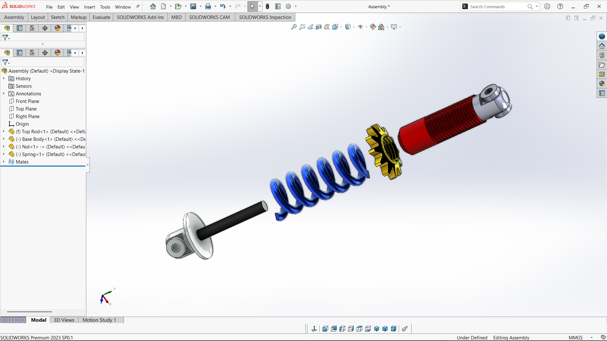

### Objective
To design and assemble a telescopic shock absorber model.

### Work Done
- Modeled piston rod, cylinder tube, spring
- Created exploded assembly view
- Generated sectional drawings
- Understood damping mechanism concept

### Key Learning
- Fluid damping principle (conceptual)
- Telescopic mechanism design
- Design for serviceability

---

# 📊 Engineering Strengths

- Strong 3D modeling fundamentals
- Clear understanding of mechanical assemblies
- Motion mechanism interpretation
- Automotive system interest
- Design documentation skills

---

# 📬 Contact
LinkedIn: www.linkedin.com/in/kathirvelan-s-9910bb36a

Email: kathirvelansadaiyandi@gmail.com
